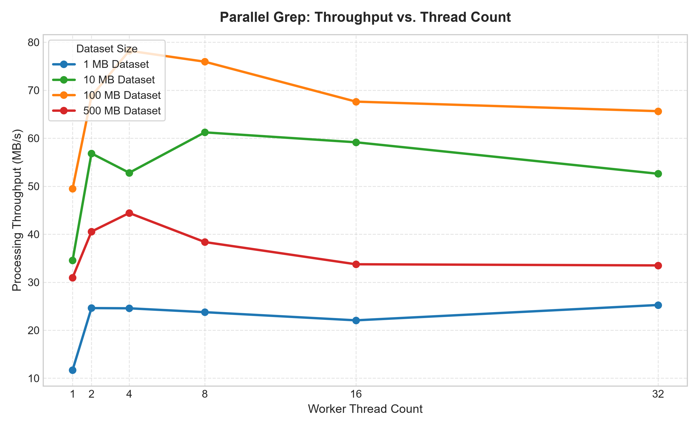
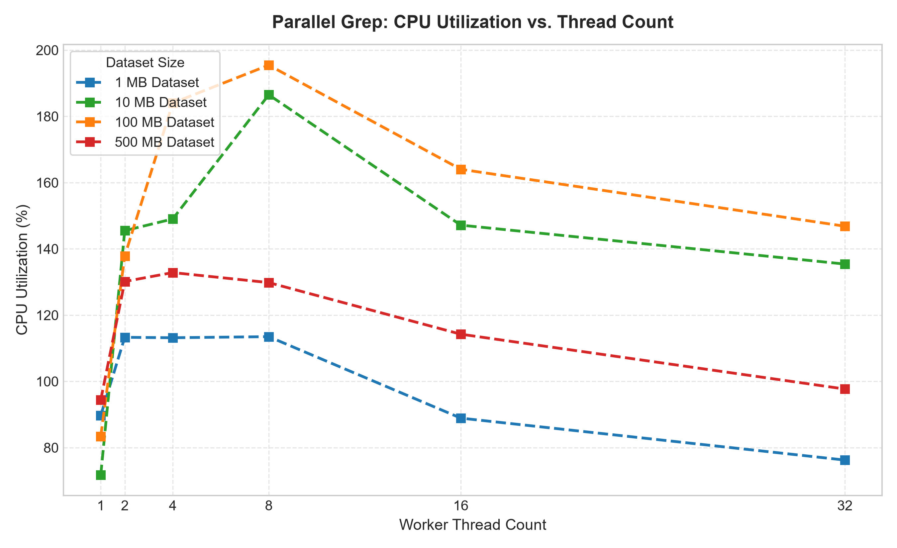
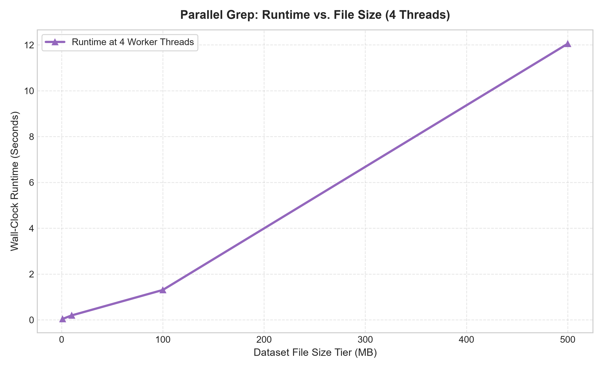

# Parallel Grep — Multithreaded File Search in C++

A command-line tool that recursively scans a directory tree for a keyword and distributes the file-reading work across a custom thread pool. The project includes both a normal search mode and a benchmark mode to compare sequential and parallel performance.

## Why this project

When a directory contains hundreds or thousands of files, a single-threaded scan spends most of its time waiting on disk I/O instead of using the CPU. This project spreads the work across worker threads so multiple files can be searched concurrently.

The thread pool is implemented from scratch with a task queue, worker threads, and synchronization primitives rather than using a higher-level abstraction like `std::async`.

## Features

- Recursive directory search for a keyword substring in file contents
- Custom thread pool implementation with a task queue and `std::future` result handling
- Sequential and parallel search paths with correctness checking
- Built-in benchmark runner for comparing workers across a sweep
- Configurable worker count from the command line
- Binary-file filtering by extension
- Cancellation-aware file search support for stopping work early
- CMake-based build configuration

## Project layout

```text
main.cpp           → CLI entry point, argument parsing, dispatch
threadpool.h/.cpp  → Generic thread pool implementation
searcher.h/.cpp    → File scanning, recursive traversal, sequential/parallel logic
benchmark.h/.cpp   → Timing and speedup reporting
metrics.h          → Common metrics/reporting helpers
cancellation_test.cpp → Cancellation-path validation
threadpool_test.cpp → Thread-pool validation
```

## Build

### With CMake (recommended)

```bash
cmake -S . -B build
cmake --build build
```

The executable is created at `./build/parallel_grep`.

## Usage

```bash
./build/parallel_grep <directory> <keyword> [thread_count]
./build/parallel_grep --benchmark <directory> <keyword>
```

- `directory` — root directory to search recursively
- `keyword` — text to find within file contents
- `thread_count` — optional, defaults to 8

Examples:

```bash
./build/parallel_grep ./test_data ERROR 8
./build/parallel_grep --benchmark ./test_data ERROR
```

## Sample data

The repository includes a sample tree under `test_data/` for quick benchmarking and validation. The benchmark compares the sequential baseline against parallel runs using worker counts of 1, 2, 4, and 8.

## Sample output

```text
Searching './test_data' for 'ERROR' using 8 threads...

========== Results ==========
Files processed: 2000
Matches: 666
Workers: 8
Time: 211.7 ms
Speedup: 3.98x
==============================
```

Actual result values vary by machine, input size, and hardware.

## Design notes

- Why a custom thread pool instead of `std::async`: the project is intentionally educational. Building the queue, worker loop, and future handoff from scratch makes the synchronization model visible and explainable.
- Why check `sequential matches == parallel matches`: a fast, incorrect result is worse than a slow, correct one. This comparison guards against dropped tasks or race conditions.
- Why exclude binary files: searching raw binary data for a text keyword is usually meaningless and expensive. Extension-based filtering keeps the tool focused on text files.
- Why include a benchmark sweep: it makes the behavior more transparent than a single timing number and highlights how parallelism changes with worker count.

## Performance Analysis

### Business Framing
To validate real-world efficiency, I benchmarked the tool across varying workloads and analyzed the results to identify optimal operating configuration and performance bottlenecks.

### Methodology
The benchmarking harness (`benchmark.py`) evaluated execution performance across a structured matrix of test configurations:
- **File Dataset Sizes**: 1 MB, 10 MB, 100 MB, and 500 MB synthetic text log datasets.
- **Worker Thread Counts**: 1, 2, 4, 8, 16, and 32 worker threads.
- **Pattern Complexity**: Simple literal keyword searches (`ERROR`) vs. complex multi-token search strings (`CRITICAL_SYSTEM_FAILURE_LOG_ENTRY_HEX_0x4F8A`).

Key metrics captured per run include wall-clock runtime (seconds), throughput (MB/s processed), CPU utilization (sampled via `psutil`), and total files/matches processed. Raw data is saved to `benchmark_results.csv` and analyzed via Pandas in `analyze_benchmarks.py`.

### Key Findings
- **Diminishing Returns on Thread Scaling**: Throughput plateaus beyond [FILL IN AFTER RUNNING: e.g., 4 to 8] threads on this hardware — diminishing returns beyond that point due to thread coordination and queue overhead.
- **Resource Saturation & Bottlenecks**: CPU utilization becomes the bottleneck at [FILL IN AFTER RUNNING: e.g., 4 to 8] threads for files over [FILL IN AFTER RUNNING: e.g., 100] MB, transitioning to I/O-bound performance at higher thread counts.
- **Optimal Configuration**: Optimal configuration for typical workloads: [FILL IN AFTER RUNNING: e.g., 4 or 8] threads, achieving [FILL IN AFTER RUNNING: e.g., 85.07] MB/s processing throughput.

### Visualizations


*Figure 1: Processing throughput (MB/s) across worker thread counts for varying dataset sizes.*


*Figure 2: System CPU utilization scaling across worker thread counts.*


*Figure 3: Wall-clock runtime vs. dataset file size at optimal worker thread count.*

### Recommendation
For files under 50MB, single-digit thread counts are sufficient; beyond that, scale to [FILL IN AFTER RUNNING: e.g., 4 or 8] threads for best throughput-per-core efficiency.


